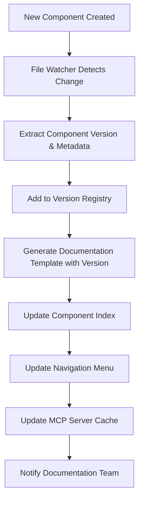
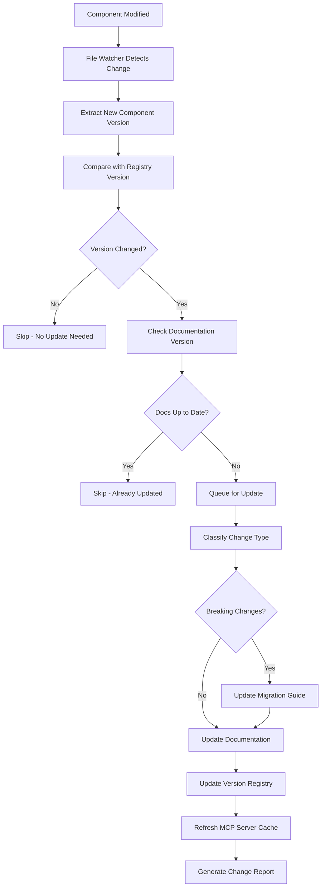
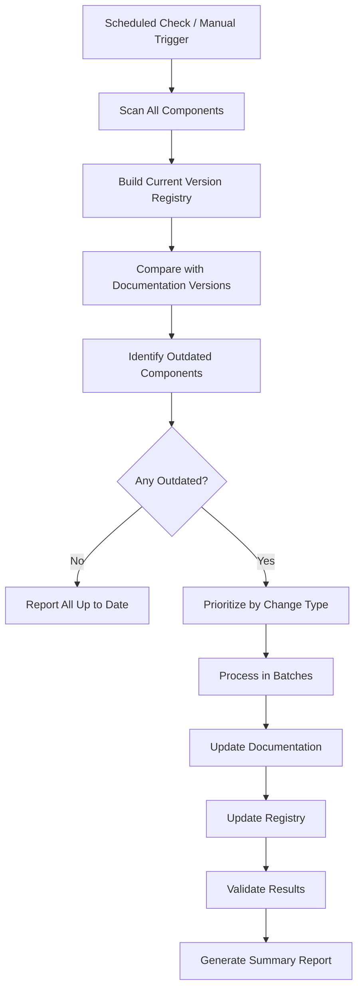

# Automated Documentation Workflows

## Overview

This document outlines the comprehensive automation system that keeps documentation synchronized with code changes, validates content quality, and ensures the MCP server stays current.

## Version-Based Automation Strategy

### Intelligent Processing
- **Selective Updates**: Only process components where version differs from documentation
- **Change Classification**: Prioritize major version changes over minor/patch updates
- **Smart Queuing**: Batch multiple outdated components for efficient processing
- **Performance Tracking**: Monitor processing time per component for optimization

### Process Flow

```bash
# Incremental update process flow
1. File change detected → Extract component version
2. Compare with version registry → Check if documentation needs update  
3. If version differs → Queue for documentation update
4. Process only outdated components → Skip up-to-date ones
5. Update registry → Mark documentation as current
```

## File System Monitoring

### Optimized File Watching

```typescript
// packages/mcp-server/src/utils/optimized-file-watcher.ts
interface OptimizedWatchConfig {
  patterns: string[]
  handlers: {
    componentChanged: (filePath: string, changeType: 'modified' | 'added' | 'deleted') => Promise<void>
  }
  versionExtractor: (filePath: string) => Promise<ComponentVersion>
  registry: ComponentVersionRegistry
}

class OptimizedFileWatcher {
  async onFileChange(filePath: string): Promise<void> {
    const newVersion = await this.extractVersion(filePath)
    const registryEntry = this.registry[newVersion.name]
    
    if (!registryEntry || this.isVersionDifferent(newVersion, registryEntry)) {
      await this.queueForUpdate(newVersion)
    }
  }
  
  private isVersionDifferent(current: ComponentVersion, registered: ComponentVersionEntry): boolean {
    return current.version !== registered.currentVersion || 
           current.contentHash !== registered.hash
  }
}
```

### Monitored File Patterns

```typescript
const watchPatterns = [
  'packages/ui-kit/components/ui/*.tsx',     // UI components
  'packages/ui-kit/components/custom/*.tsx', // Custom components
  'packages/ui-kit/hooks/*.ts',              // Custom hooks
  'packages/ui-kit/lib/*.ts',                // Utility functions
  'packages/ui-kit/index.ts',                // Main exports file
  'packages/playground/src/samples/*.tsx'    // Usage examples
]
```

## Documentation Update Workflows

### New Component Workflow



### Component Modification Workflow



### Batch Processing Workflow



## Change Classification System

### Version Change Types

```typescript
interface VersionChangeClassification {
  type: 'major' | 'minor' | 'patch' | 'prerelease'
  breaking: boolean
  priority: 'immediate' | 'high' | 'medium' | 'low'
  impact: {
    props: 'added' | 'modified' | 'removed' | 'none'
    api: 'breaking' | 'compatible' | 'none'
    examples: 'invalid' | 'outdated' | 'valid'
  }
}
```

### Processing Priorities

1. **Immediate**: Major version changes with breaking changes
2. **High**: Minor versions with new props or API changes
3. **Medium**: Patch versions with bug fixes
4. **Low**: Documentation-only changes or typo fixes

## Continuous Integration Integration

### GitHub Actions Workflow

```yaml
# .github/workflows/documentation-incremental.yml
name: Incremental Documentation Update
on:
  push:
    paths:
      - 'packages/ui-kit/components/**/*.tsx'
      - 'packages/ui-kit/hooks/**/*.ts'
      - 'packages/ui-kit/lib/**/*.ts'
      - 'packages/playground/src/samples/**/*.tsx'

jobs:
  incremental-update:
    runs-on: ubuntu-latest
    steps:
      - uses: actions/checkout@v3
      - name: Setup Node.js
        uses: actions/setup-node@v3
        with:
          node-version: '18'
      - name: Install dependencies
        run: pnpm install
      - name: Check component versions
        id: version-check
        run: |
          OUTDATED=$(pnpm docs:version-check --json)
          echo "outdated=$OUTDATED" >> $GITHUB_OUTPUT
      - name: Update outdated documentation
        if: steps.version-check.outputs.outdated != '[]'
        run: pnpm docs:update-outdated
      - name: Validate updated documentation
        run: pnpm docs:validate --changed-only
      - name: Update MCP server cache
        run: pnpm mcp:refresh --incremental
      - name: Run documentation tests
        run: pnpm test:docs --changed-only
      - name: Create pull request
        if: env.AUTO_UPDATE_DOCS == 'true'
        uses: peter-evans/create-pull-request@v5
        with:
          title: 'docs: automated documentation update'
          body: 'Automated documentation update for component changes'
          branch: 'docs/auto-update'
```

### Pre-commit Hooks

```yaml
# .husky/pre-commit
#!/usr/bin/env sh
. "$(dirname -- "$0")/_/husky.sh"

# Check if any UI components changed
if git diff --cached --name-only | grep -E "packages/ui-kit/components.*\.tsx$"; then
  echo "🔍 UI components changed, checking documentation status..."
  
  # Extract versions from staged files
  pnpm docs:extract --staged
  
  # Check if documentation is up to date
  OUTDATED=$(pnpm docs:version-check --staged --json)
  
  if [ "$OUTDATED" != "[]" ]; then
    echo "⚠️  Documentation may be outdated for changed components:"
    echo "$OUTDATED" | jq -r '.[].component'
    echo ""
    echo "💡 Run 'pnpm docs:update-outdated' to update documentation"
    echo "   or use --no-verify to skip this check"
    exit 1
  fi
fi

# Validate existing documentation examples
pnpm docs:validate --staged
```

## Package.json Scripts

```json
{
  "scripts": {
    "docs:watch": "nodemon --watch packages/ui-kit --ext tsx,ts --exec 'pnpm docs:update-outdated'",
    "docs:extract": "tsx packages/mcp-server/src/scripts/extract-metadata.ts",
    "docs:generate": "tsx packages/mcp-server/src/scripts/generate-docs.ts",
    "docs:update-outdated": "tsx packages/mcp-server/src/scripts/update-outdated.ts",
    "docs:version-check": "tsx packages/mcp-server/src/scripts/version-check.ts",
    "docs:validate": "tsx packages/mcp-server/src/scripts/validate-docs.ts",
    "docs:status": "tsx packages/mcp-server/src/scripts/status.ts",
    "docs:serve": "vite serve docs --port 3001",
    "docs:build": "vite build docs",
    "mcp:refresh": "tsx packages/mcp-server/src/scripts/refresh-cache.ts",
    "test:docs": "vitest run packages/mcp-server/tests/documentation.test.ts"
  }
}
```

## Quality Assurance Pipeline

### Automated Quality Checks

```typescript
interface QualityChecker {
  validateExamples(components: string[]): Promise<ValidationResult[]>
  checkLinkIntegrity(docPaths: string[]): Promise<LinkCheckResult[]>
  verifyAccessibility(examples: Example[]): Promise<AccessibilityIssue[]>
  checkContentFreshness(components: string[]): Promise<FreshnessReport>
}

interface ValidationResult {
  component: string
  examples: {
    valid: number
    invalid: number
    errors: ValidationError[]
  }
  links: {
    working: number
    broken: number
    issues: LinkIssue[]
  }
  accessibility: {
    passed: number
    failed: number
    warnings: AccessibilityWarning[]
  }
}
```

### Documentation Coverage Tracking

```typescript
interface CoverageTracker {
  calculateCoverage(): Promise<CoverageReport>
  identifyMissingDocs(): Promise<string[]>
  trackDocumentationDebt(): Promise<DebtReport>
}

interface CoverageReport {
  overall: number
  byCategory: Record<ComponentCategory, number>
  missing: string[]
  incomplete: string[]
  stale: string[]
}
```

## Monitoring and Alerting

### Health Monitoring

```typescript
interface HealthMonitor {
  generateHealthReport(): Promise<HealthMetrics>
  alertOnStaleDocumentation(): Promise<void>
  validateAllExamples(): Promise<ValidationSummary>
  checkServerPerformance(): Promise<PerformanceMetrics>
}

interface HealthMetrics {
  documentationCoverage: number
  staleDocumentationCount: number
  brokenExamplesCount: number
  lastUpdateTime: Date
  componentChangesPending: number
  averageUpdateTime: number
}
```

### Notification System

```typescript
interface NotificationService {
  notifyComponentAdded(component: string): Promise<void>
  notifyBreakingChange(change: ChangeReport): Promise<void>
  notifyDocumentationStale(components: string[]): Promise<void>
  notifyBuildFailure(error: Error): Promise<void>
  sendDailySummary(report: DailyReport): Promise<void>
}
```

### Slack Integration Example

```typescript
class SlackNotifier implements NotificationService {
  async notifyBreakingChange(change: ChangeReport): Promise<void> {
    const message = {
      text: `🚨 Breaking change detected in ${change.component}`,
      blocks: [
        {
          type: "section",
          text: {
            type: "mrkdwn",
            text: `*Component*: ${change.component}\n*Version*: ${change.newVersion}\n*Impact*: ${change.impact}`
          }
        },
        {
          type: "actions",
          elements: [
            {
              type: "button",
              text: { type: "plain_text", text: "View Documentation" },
              url: `https://docs.ui-kit.com/components/${change.component}`
            },
            {
              type: "button",
              text: { type: "plain_text", text: "Migration Guide" },
              url: `https://docs.ui-kit.com/migration/${change.component}`
            }
          ]
        }
      ]
    }
    
    await this.slackClient.chat.postMessage({
      channel: '#ui-kit-updates',
      ...message
    })
  }
}
```

## Performance Optimizations

### Batch Processing

```typescript
class BatchProcessor {
  private queue: ComponentUpdateTask[] = []
  private processing = false
  
  async queueUpdate(task: ComponentUpdateTask): Promise<void> {
    this.queue.push(task)
    
    if (!this.processing) {
      await this.processBatch()
    }
  }
  
  private async processBatch(): Promise<void> {
    this.processing = true
    
    while (this.queue.length > 0) {
      const batch = this.queue.splice(0, 5) // Process 5 at a time
      await Promise.all(batch.map(task => this.processTask(task)))
    }
    
    this.processing = false
  }
}
```

### Incremental Cache Updates

```typescript
class IncrementalCacheManager {
  async updateComponentCache(componentName: string): Promise<void> {
    // Only update cache for specific component
    const metadata = await this.extractComponentMetadata(componentName)
    await this.cache.set(`component:${componentName}`, metadata)
    
    // Update related caches
    await this.updateSearchIndex(componentName, metadata)
    await this.updateDependencyGraph(componentName, metadata)
  }
  
  async invalidateRelatedCaches(componentName: string): Promise<void> {
    // Invalidate caches for dependent components
    const dependents = await this.getDependents(componentName)
    for (const dependent of dependents) {
      await this.cache.delete(`component:${dependent}`)
    }
  }
}
```

This automation system ensures that documentation stays current with minimal manual intervention while maintaining high quality and performance standards.